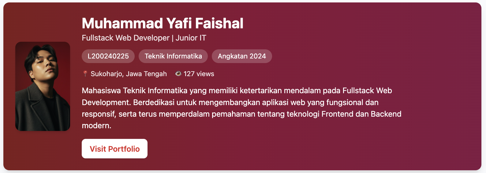
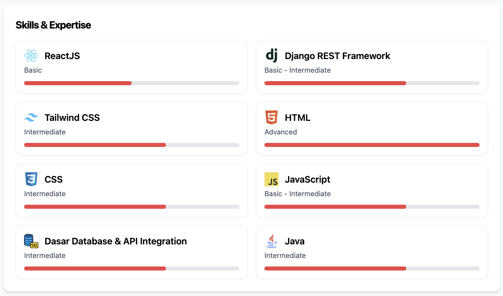
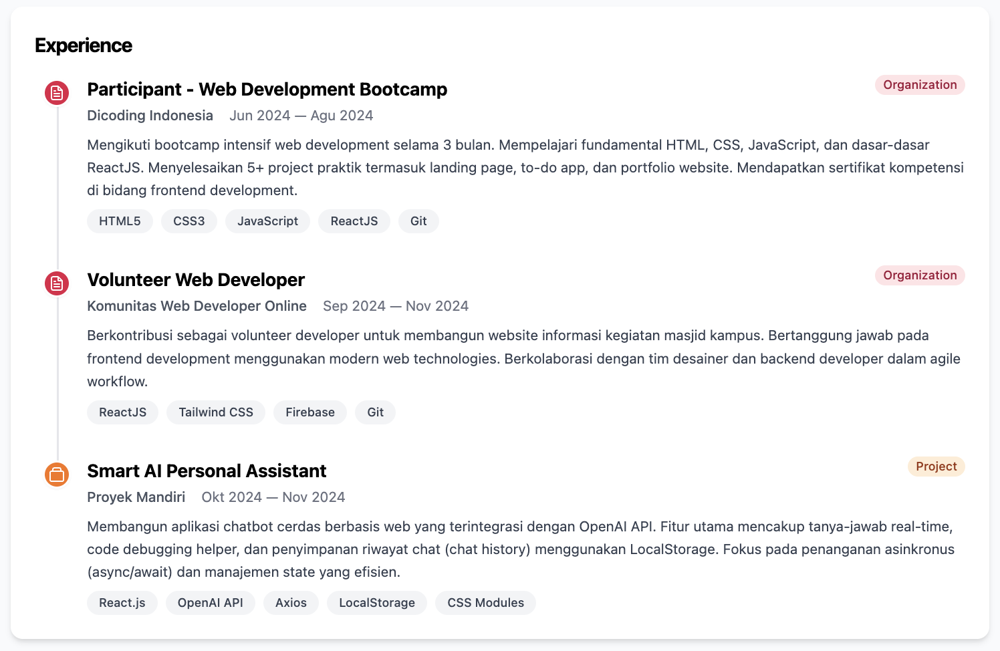
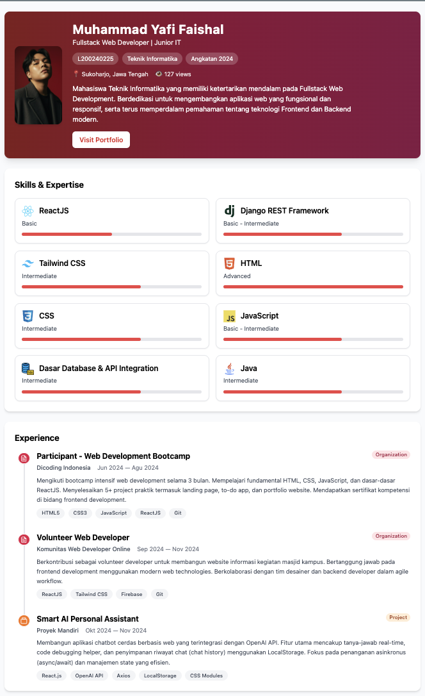

# DOC.md

## 1. Application Description

Aplikasi ini adalah Single Page Application (SPA) berbasis React yang menampilkan Curriculum Vitae (CV) mahasiswa dalam bentuk web portfolio modern dan responsif.  
Halaman utama berisi tiga bagian utama:

- **Profile** – menampilkan foto, nama lengkap, NIM, program studi, angkatan, lokasi, dan deskripsi singkat tentang diri.  
- **Skills & Expertise** – menampilkan daftar skill beserta level (Basic / Intermediate / Advanced) dan lama pengalaman dengan progress bar.  
- **Experience** – menampilkan riwayat pengalaman seperti project, organisasi, dan internship dalam bentuk timeline vertikal dengan badge kategori dan rentang tanggal.

Seluruh data profil, skill, dan pengalaman disimpan dalam berkas `dataMahasiswa.json` sehingga konten dapat diubah tanpa mengedit kode komponen.

---

## 2. How to Run the Project

### Prasyarat

- Node.js dan npm sudah terpasang di komputer.

### Langkah Menjalankan

1. Clone atau download repository ini.  
2. Buka folder project di terminal.  
3. Install dependency:
    "npm install"
4. Jalankan aplikasi dalam mode development:
    "npm run dev"

5. Buka URL yang ditampilkan di terminal (biasanya `http://localhost:5173`) di browser.

### Build untuk Production

Untuk membuat build production, jalankan:
    "npm run build"
    "npm run preview"

Kemudian akses URL preview yang ditampilkan di terminal.

---

## 3. Deployment Link

Aplikasi ini telah dideploy secara online sehingga dapat diakses publik.

- Platform: **Vercel**
- Deployment URL: [**https://spa-cv-portfolio-yafi-faishal.vercel.app/**](https://spa-cv-portfolio-yafi-faishal.vercel.app/)

---

## 4. Screenshots

Berikut beberapa cuplikan tampilan aplikasi:

1. **Tampilan halaman utama portfolio** – berisi hero section dengan foto profil, nama, informasi singkat, dan tombol “Visit Portfolio”.  
   

2. **Section Skills & Expertise** – menampilkan kartu skill seperti ReactJS, Django REST Framework, Tailwind CSS, HTML, CSS, JavaScript, dan lain‑lain dengan progress bar sesuai level.  
   

3. **Section Experience** – menampilkan timeline pengalaman seperti freelance project, internship, organisasi kampus, dan project mandiri dengan badge kategori (project, organization, internship).  
   

4. **Tampilan akhir portfolio setelah data pribadi diisi** – menunjukkan kombinasi warna utama yang konsisten dengan foto profil dan brand personal.  
   